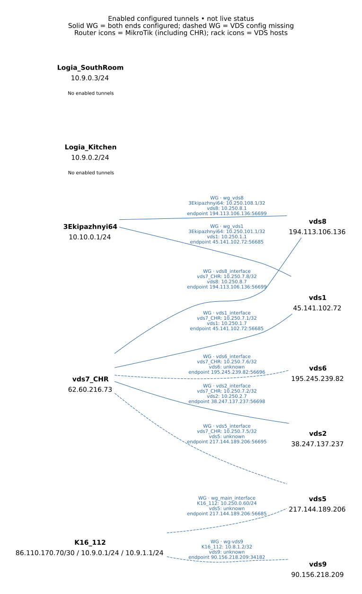
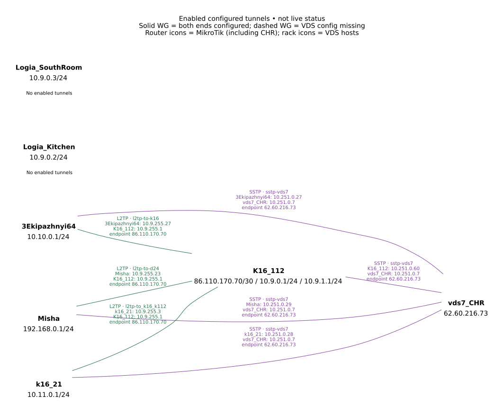

# Tunnel topology

Repository configuration analysis, 2026-10-03. All seven MikroTik exports and desired YAML configurations, host variables, inventories, and the WireGuard role were inspected. This describes enabled configuration, not current reachability or successful handshakes. Secrets are omitted.

[Combined tunnel diagram](all-tunnels.svg)

## Enabled links

Addresses are shown in the order of the two devices. PPP addresses come from the destination router’s matching user account and are assigned when a session connects. Bare RouterOS WireGuard IPs are shown as /32.

| Device A | Device B | Protocol | A tunnel IP | B tunnel IP | A interface | Destination endpoint | Evidence |
|---|---|---|---|---|---|---|---|
| Misha | K16_112 | L2TP | 10.9.255.23 | 10.9.255.1 | l2tp-to-d24 | 86.110.170.70 | PPP assigned on connection |
| Misha | vds7_CHR | SSTP | 10.251.0.29 | 10.251.0.7 | sstp-vds7 | 62.60.216.73 | PPP assigned on connection |
| K16_112 | vds5 | WG | 10.250.0.60/24 | unknown | wg_main_interface | 217.144.189.206:56685 | VDS config missing |
| K16_112 | vds9 | WG | 10.8.1.2/32 | unknown | wg-vds9 | 90.156.218.209:34182 | VDS config missing |
| K16_112 | vds7_CHR | SSTP | 10.251.0.60 | 10.251.0.7 | sstp-vds7 | 62.60.216.73 | PPP assigned on connection |
| k16_21 | K16_112 | L2TP | 10.9.255.3 | 10.9.255.1 | l2tp-to_k16_k112 | 86.110.170.70 | PPP assigned on connection |
| k16_21 | vds7_CHR | SSTP | 10.251.0.28 | 10.251.0.7 | sstp-vds7 | 62.60.216.73 | PPP assigned on connection |
| 3Ekipazhnyi64 | vds1 | WG | 10.250.101.1/32 | 10.250.1.1 | wg_vds1 | 45.141.102.72:56685 | both ends configured |
| 3Ekipazhnyi64 | vds8 | WG | 10.250.108.1/32 | 10.250.8.1 | wg_vds8 | 194.113.106.136:56699 | both ends configured |
| 3Ekipazhnyi64 | K16_112 | L2TP | 10.9.255.27 | 10.9.255.1 | l2tp-to-k16 | 86.110.170.70 | PPP assigned on connection |
| 3Ekipazhnyi64 | vds7_CHR | SSTP | 10.251.0.27 | 10.251.0.7 | sstp-vds7 | 62.60.216.73 | PPP assigned on connection |
| vds7_CHR | vds5 | WG | 10.250.7.5/32 | unknown | vds5_interface | 217.144.189.206:56695 | VDS config missing |
| vds7_CHR | vds6 | WG | 10.250.7.6/32 | unknown | vds6_interface | 195.245.239.82:56696 | VDS config missing |
| vds7_CHR | vds1 | WG | 10.250.7.1/32 | 10.250.1.7 | vds1_interface | 45.141.102.72:56685 | both ends configured |
| vds7_CHR | vds8 | WG | 10.250.7.8/32 | 10.250.8.7 | vds8_interface | 194.113.106.136:56699 | both ends configured |
| vds7_CHR | vds2 | WG | 10.250.7.2/32 | 10.250.2.7 | vds2_interface | 38.247.137.237:56698 | both ends configured |

## Host WireGuard services

`01_bare_host.yml` runs the WireGuard role only when `wireguard_enabled` is true. It creates `/etc/wireguard/wg0.conf` and enables/starts `wg-quick@wg0`. All configured hosts use MTU 1420. The firewall role defaults its WireGuard UDP input rule to the same listen port.

| Host | Public/inventory IP | wg0 addresses | UDP port | Peers and AllowedIPs |
|---|---|---|---|---|
| vds2 | 38.247.137.237 | 10.250.2.7/32 | 56698 | vds7: 10.250.7.2/32 |
| vds8 | 194.113.106.136 | 10.250.8.7/32, 10.250.8.1/32 | 56699 | vds7: 10.250.7.8/32; mikrotik-3Ekipazhnyi64: 10.250.108.1/32, 10.10.0.0/16 |
| vds1 | 45.141.102.72 | 10.250.1.7/32, 10.250.1.1/32 | 56685 | mikrotik-vds7: 10.250.7.1/32; mikrotik-3Ekipazhnyi64: 10.250.101.1/32, 10.10.0.0/16 |

## Findings and scope limits

- Five WG links have both peer configurations in scope: CHR–vds1, CHR–vds2, CHR–vds8, 3Ekipazhnyi64–vds1, and 3Ekipazhnyi64–vds8. Peer identity is correlated by endpoint and peer name; private-key derivation and live handshake verification were not performed.
- Four WG links are enabled on MikroTik but have no corresponding host service configuration in scope: CHR–vds5 (UDP 56695), CHR–vds6 (UDP 56696), and K16_112–vds5 (UDP 56685). vds5 and vds6 have host variables but inherit `wireguard_enabled: false`. K16_112–vds9 is another router-side link; vds9 has no inventory or host variables here. 
- The diagram uses `unknown` for these VDS-side tunnel IPs; AllowedIPs=0.0.0.0/0 does not identify a remote interface address.
- vds1 and vds8 each use two /32 addresses on wg0. Peer-specific `source_address` settings choose 10.250.1.7 for CHR and 10.250.1.1 for 3Ekipazhnyi64 on vds1; vds8 selects 10.250.8.1 for 3Ekipazhnyi64. Their site AllowedIPs include 10.10.0.0/16, broader than the exported site LAN 10.10.0.0/24.
- CHR has WG MTU 1340 for vds5/vds6 and its phone server; its links to vds1/vds2/vds8 use 1420.
- K16_112 additionally serves ASUS ZenFone7: wg-server 10.9.250.1/24, UDP 56685; phone AllowedIPs 10.9.250.2/32. CHR serves Gor iPhone: WG-server 10.252.7.1/24, UDP 51820; phone AllowedIPs 10.252.7.2/32. These are client devices, outside the host/router diagram.
- Logia_Kitchen (10.9.0.2/24) and Logia_SouthRoom (10.9.0.3/24; loopback 10.9.99.2/32) have no enabled tunnel links. Their shared LAN is not drawn as a tunnel.
- Inventory names vds3 and k16_k112_server both use 86.110.170.70, also K16_112’s WAN address. This alone does not establish a separate host tunnel or prove that these names refer to the router itself; neither has an enabled WG service defined.
- Additional enabled PPP accounts on K16_112 have no corresponding client configuration in scope, so no active device links are inferred from accounts alone. Misha’s address on unresolved interface *B likewise does not prove a tunnel.

## Exclusions

- Explicitly disabled WG: 3Ekipazhnyi64 wg_client_vds5 and its peer/address; Logia_SouthRoom wg-client and its peer/address. CHR’s disabled 10.250.0.7/24 address is omitted.
- RouterOS exports omit unchanged defaults. L2TP and SSTP clients default to disabled=yes, so only explicit disabled=no clients are included. Excluded default-disabled clients: K16_112 l2tp-to-RuVDS, l2tp-to-vds8, sstp-RuVDS; 3Ekipazhnyi64 l2tp-to-vds8. Thus vds9 WG is enabled, while those PPP links are not.
- OVPN server definitions omit enabled=yes and default to disabled; no OVPN client link is established by those entries. No explicit GRE, EoIP, IPIP, VXLAN, or site-to-site IPsec tunnel configuration was found.

Defaults: [MikroTik L2TP documentation](https://help.mikrotik.com/docs/spaces/ROS/pages/2031631/L2TP), [MikroTik SSTP documentation](https://help.mikrotik.com/docs/spaces/ROS/pages/2031645/SSTP).

## Sources

- `mikrotik/routers/<identity>/<identity>.yml` and matching `.rsc`: interfaces, peers, addresses, PPP services/accounts.
- `host_vars/vds1.yml`, `host_vars/vds2.yml`, `host_vars/vds8.yml`: enabled host WireGuard settings.
- `inventory/*`, `mikrotik/host_vars/*.yml`: device endpoint and management addresses.
- `roles/wireguard/{defaults,tasks,handlers}/main.yaml`, `roles/wireguard/templates/wg.conf.j2`, `01_bare_host.yml`, and `roles/iptables/`: service behavior.

Editable diagram sources: `wireguard.dot`, `ppp-tunnels.dot`; render with `dot -Tsvg wireguard.dot -o wireguard.svg`. Run from this directory so the shared router/server icon paths resolve.
