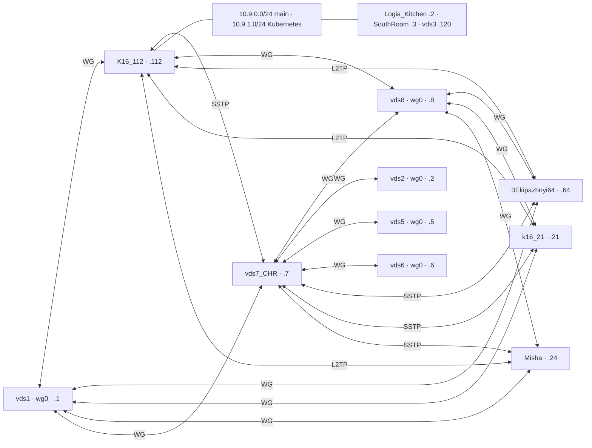

# Current tunnel topology — 2026-10-05

Live interfaces and OSPF adjacencies were checked after deployment. Retired
interfaces and phone VPNs are omitted. All Linux WireGuard links use `wg0`.

Transport addressing uses each node's suffix above:

| Transport | Client address | Server | OSPF cost |
| --- | --- | --- | --- |
| WireGuard to vds1 | 10.250.1.N/24 | 10.250.1.1 | 1000 |
| WireGuard to vds8 | 10.250.1.N/24 | 10.250.1.8 | 30000 |
| CHR ↔ Linux WireGuard | CHR 10.250.1.7/24 | Linux 10.250.1.N/24 | 1000; vds8 30000 |
| SSTP to CHR | 10.250.0.N/32 | Legacy PPP endpoint 10.251.0.7 | 10 |
| L2TP to K16_112 | 10.250.3.N/32 | 10.250.3.112 | 100 |

There are 13 WireGuard, four SSTP and three L2TP links. WireGuard MTU is
1420 except CHR links to vds5/vds6 (1340). Loopbacks are `10.255.0.N/32`.
vds3 is a LAN host, not a WireGuard endpoint. LAN labels `.2/.3/.120` above
are addresses in `10.9.0.0/24`, not transport suffixes.

## Source NAT policy

`network-policy.yml` deploys a first-match no-SNAT exemption for source and
destination inside `10.0.0.0/8`. Active router masquerade is WAN-only and
excludes destinations in `10/8`; Linux host masquerade likewise excludes
`10/8`. Docker/Amnezia-managed `172.x` egress and container hairpin rules
are retained; container networks are not part of the routed `10/8` fabric.

Disabled redundant rules: CHR's `out SSTP`, 3Ekip's SSTP/invalid-interface
masquerade, Misha's SSTP masquerade, and K16's LAN hairpin masquerade.
Misha's unrestricted masquerade now uses the `EXTERNAL` uplink list.
DNAT/port forwarding is unchanged. K16 LAN clients should use private
service addresses or split DNS instead of relying on public-IP hairpin NAT.
Existing conntrack sessions may retain old NAT until they expire; conntrack
was not flushed to avoid interrupting unrelated connections.

FRR is installed by the `Install FRR` task in root `ospf.yml`, which includes
`roles/ospf/tasks/compatible-frr.yml` for the signed official `frr-10.4`
repository on older distributions. It renders
`roles/ospf/templates/frr.conf.j2` to `/etc/frr/frr.conf`, enables `ospfd` in
`/etc/frr/daemons`, and starts the `frr` service. This play includes role
files directly rather than invoking a conventional `roles: [ospf]` entry.
