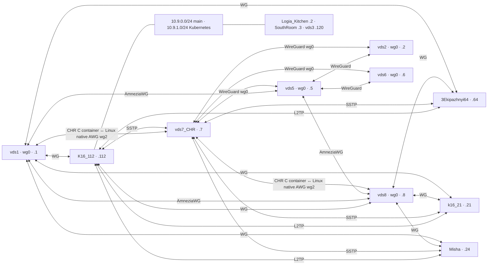

# Current tunnel topology — 2026-10-05

Live interfaces and OSPF adjacencies were checked after deployment. Retired
interfaces and phone VPNs are omitted. Linux `wg0` retains ordinary site
WireGuard. AmneziaWG remains on vds1/vds5/vds8 `wg1`, while two CHR C containers
connect to vds1/vds8 native `wg2`. vds2/vds6 now use ordinary `wg0` to CHR
and ordinary `wg1` to vds5; vds5 uses `wg0` to CHR and independent
`wg-vds2`/`wg-vds6` ordinary mesh interfaces. Linux C
proxy services have been removed from vds1/vds2/vds5/vds6/vds8. Addresses,
keys and OSPF costs are unchanged; dedicated CHR links use point-to-point OSPF.

[SVG drawing](current-tunnels.svg) · [PNG drawing](current-tunnels.png)

The drawing aligns vds8/vds7_CHR/vds6 on the upper row and
vds1/vds5/vds2 on the lower row. The original straight-link style is restored;
connections within each row are horizontal. Row centers are at y=260 and
y=430, symmetric about y=345 in the gap between 3Ekipazhnyi64 and k16_21.
Line crossings
are not junctions; connections terminate at device boxes only.

Transport addressing uses each node's suffix above:

| Transport | Client address | Server | OSPF cost |
| --- | --- | --- | --- |
| WireGuard to vds1 | 10.250.1.N/24 | 10.250.1.1 | 1000 |
| WireGuard to vds8 | 10.250.1.N/24 | 10.250.1.8 | 30000 |
| CHR C container ↔ Linux native AWG wg2 | CHR 10.250.1.7/24 | vds1/vds8 10.250.1.N/24 | 1000; vds8 30000 |
| CHR ↔ ordinary Linux wg0 | CHR 10.250.1.7/24 | vds2/vds5/vds6 10.250.1.N/24 | 1000; vds5 1001 |
| Ordinary WG star to vds5 | vds2/vds6 10.250.2.N/24 | 10.250.2.5/24 | 200 |
| AmneziaWG star to vds5 | vds1/vds8 10.250.2.N/24 | 10.250.2.5/24 | 200 |
| AmneziaWG vds1 ↔ vds8 | 10.250.2.1/24 | 10.250.2.8/24 | 200 |
| SSTP to CHR | 10.250.0.N/32 | Legacy PPP endpoint 10.251.0.7 | 10 |
| L2TP to K16_112 | 10.250.3.N/32 | 10.250.3.112 | 100 |

There are thirteen ordinary WireGuard, five AmneziaWG (two CHR links and
three native mesh links), four SSTP and three L2TP links (25 total). Site WG
MTU is 1420; CHR and inter-VDS tunnels use 1340. Loopbacks are `10.255.0.N/32`.
vds3 is a LAN host, not a WireGuard endpoint. LAN labels `.2/.3/.120` above
are addresses in `10.9.0.0/24`, not transport suffixes.

## AmneziaWG deployment

The one-time selective rollback used `wireguard-revert.yml`, followed by
`wireguard-revert-cleanup.yml`. Repeated health checks use
`chr-amneziawg-verify.yml`, which checks native and ordinary links separately.
The five converted links are Full in OSPF; internal LAN/loopback pings pass.
AmneziaWG packages are absent on vds2/vds6, and only vds1/vds8 containers
remain on CHR. Requested device-local VPN/routing backups were deleted;
workstation copies are retained. Plain interfaces use `Table = off`, `10/8`
plus `224.0.0.5/32` AllowedIPs and persistent keepalive off.

Remaining CHR transport migration uses root `chr-amneziawg-native.yml`; see
[native deployment and backups](chr-native-migration-status.md). It keeps
10.250.1.N addressing and original OSPF costs, with UDP 56707, keepalive off,
no internal source NAT and checks before every sequential cutover.
`wg2` reuses the original wg0 identity, not the independent wg1 mesh identity.
Its CHR peer allows routed `10/8` destinations plus OSPF multicast `224.0.0.5/32`;
`Table = off` leaves destination routing to FRR. Matching MTU 1340, numbered
point-to-point links and pinned CHR transport return routes avoid the pilot's
MTU/return-path issues. The same preserved source address exists on wg0 and
wg2; explicit interface binding separates their OSPF and transport routes.

Run root `amneziawg.yml` for vds1/vds5/vds8 and localhost;
pass `router_proxy_command` as documented in `mikrotik/README.md` when
the workstation needs the vds1 SSH jump host to reach CHR. vds5 is included
because it terminates the remaining two AWG star links. Signed official Amnezia PPA
packages provide the latest kernel module (`v3.1.20260906`, commit
`4569c4c`) and tools (`v3.1.20260812`, commit `ee0f0a9`) checked on
2026-10-05. The package version strings retain upstream's older base
version numbers; the build date/commit suffix identifies the actual release.
Debian uses the documented focal packages; Ubuntu uses noble. The PPA is
pinned to AmneziaWG packages only. Archived signed Debian headers match
the running kernel where needed; no kernel upgrade or reboot is required.

`/etc/amnezia/amneziawg/wg1.conf` is independent of ordinary WireGuard.
Private keys are generated and retained on each host, not in Git. UDP 56702
is permitted only from the peer public endpoint addresses. MTU is 1340,
`Table = off`, OSPF cost 200, hello/dead timers 60/240 seconds, and
`PersistentKeepalive = 0`. OSPF hellos and AmneziaWG's normal handshake/rekey
traffic remain; disabling persistent keepalive does not make routing silent.

The `amneziawg-routing` service reconciles learned `wg1` OSPF destination
prefixes to their next-hop peer every second. This is necessary because
WireGuard selects a peer from the destination address, not the IP route's
gateway. Duplicate AllowedIPs on multiple peers would silently select only
one peer. Direct transport `/32`s remain pinned for unicast OSPF bootstrap;
routed traffic and failover should use the `10.255.0.N` loopbacks. FRR retains
`maximum-paths 1` to ensure unique cryptokey route ownership.

Unlike the former CHR-only connectivity, vds5 can now be reached through
vds1 or vds8 without CHR. Cost 200 prefers direct AmneziaWG between VDSes,
while existing lower-cost site-to-CHR SSTP paths remain available.

The existing CHR↔vds5 link, now ordinary WireGuard, uses cost **1001 on both ends**.
Without that one-unit distinction, CHR has equal-cost routes to vds8 via
vds1 and vds5, while shared-interface cryptokey routing permits CHR's
source prefix on only one peer. Removing this ECMP tie makes CHR↔vds8
prefer vds1 symmetrically, with vds5 as the fallback.

## Source NAT policy

`network-policy.yml` deploys a first-match no-SNAT exemption for source and
destination inside `10.0.0.0/8`. Active router masquerade is WAN-only and
excludes destinations in `10/8`; Linux host masquerade likewise excludes
`10/8`. Docker/Amnezia-managed `172.x` egress and container hairpin rules
are retained; container networks are not part of the routed `10/8` fabric.

Disabled redundant rules: CHR's `out SSTP`, 3Ekip's SSTP/invalid-interface
masquerade, Misha's SSTP masquerade, and K16's LAN hairpin masquerade.
Misha's unrestricted masquerade now uses the `EXTERNAL` uplink list.
DNAT/port forwarding is unchanged. K16 LAN clients should use private
service addresses or split DNS instead of relying on public-IP hairpin NAT.
Existing conntrack sessions may retain old NAT until they expire; conntrack
was not flushed to avoid interrupting unrelated connections.

FRR is installed by the `Install FRR` task in root `ospf.yml`, which includes
`roles/ospf/tasks/compatible-frr.yml` for the signed official `frr-10.4`
repository on older distributions. It renders
`roles/ospf/templates/frr.conf.j2` to `/etc/frr/frr.conf`, enables `ospfd` in
`/etc/frr/daemons`, and starts the `frr` service. This play includes role
files directly rather than invoking a conventional `roles: [ospf]` entry.
